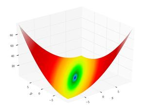

# pyalgen - A minimal library for genetic algorithm in python

### Install
```bash
pip3 install pyalgen
```

### How to use
1. Import the package

```python
import pyalgen # import pyalgen
from pyalgen import TestFunctions as tf # test functions to optimize
```
2. Define population
```python
pop = pyalgen.Population(low=-10, high=10, dtype='float', dist='uniform')
# the variable in the population is of type float and the 
# values are taken from a uniform distribution in (low, high)
population = pop(pop_size=1000, variables=2)
# variables is the number of variables to optimize. We are optimizing the 
# matyas function which has two variables
# search space ranges from -10 to 10
# pop_size is the population size of each generation
```
<p align="center">
</img>
<br>
Matyas function
</p>

3. Select type of selection and crossover process
```python
selection = pyalgen.Selection.Tournament
crossover = pyalgen.Crossover.onepoint
```

4. Instantiate Genetic Algorithm object with defined variables
```python
ga = pyalgen.GeneticAlgorithm(population, tf.matyas, selection, crossover)
```

5. Run the ga
```python
iterations, objective, pop = ga.forward(iterations=200)
# iterations is the number of generations to run for
print(f'min_value: {objective.min()}, solution: {pop[objective.argmin()]}, generation: {iterations}')
# print the minimum objective and the chromosome in population which 
# given minimum objective 
```

6. Check the result
```bash
100%|██████████████████████████████████████████████████████████| 1000/1000 [00:04<00:00, 243.41it/s]
min_value: 0.00015027951689015418, solution: [-0.01249664 -0.03509161], generation: 1000
# global minimum of matyas is at f(0, 0) = 0
# our algorithm gives minimum, f(-0.01, -0.03) = 0.0001
# which is pretty close 
```

### Results can be improved by tweaking the parameters, changing the dist type